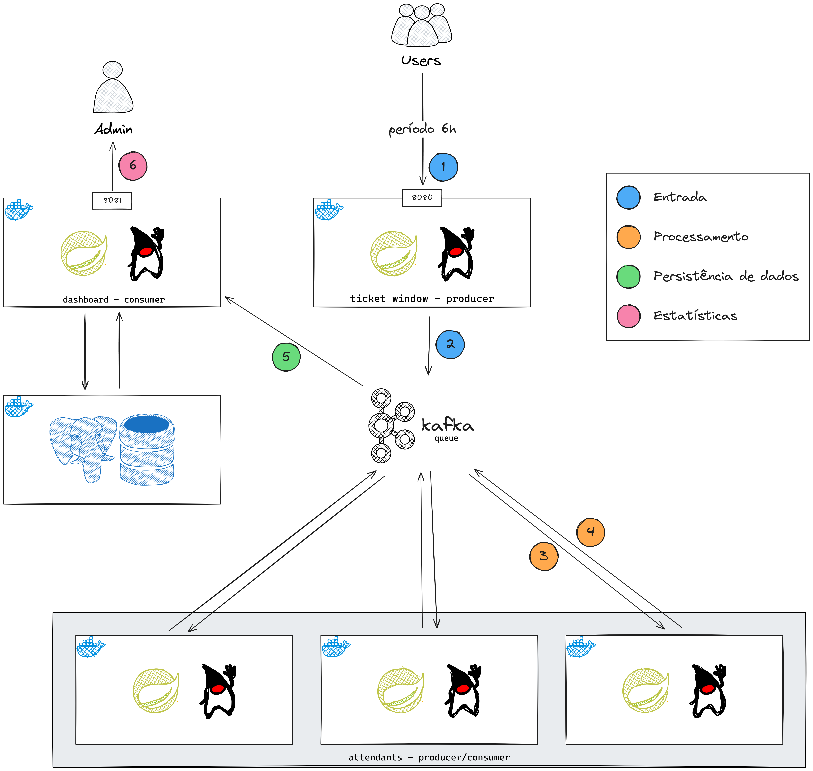

# Ticket Window

Essa aplicação visa simular o atendimento de um estabelecimento que possui
uma fila e atendentes.

## Tecnologias

- [Java 17](https://www.oracle.com/br/java/technologies/downloads/#java17)
- [Spring 3](https://spring.io/)
- [Kafka](https://kafka.apache.org/)
- [PostgreSQL](https://www.postgresql.org/)
- [Docker](https://www.docker.com/)

## Arquitetura

A aplicação é toda construída envolta do **Kafka** e se comunica por filas
consumidas pelos [módulos](#módulos).

### Fluxo de funcionamento

1. Usuário faz a requisição para endpoint `/queue`, é verificado se
a aplicação está em período de trabalho (6h), se estiver, o cliente vai
para o **passo 2**, caso contrário, recebe a mensagem.
   ``json
   {
      "message": "We are not in work hour!"
   }
   ``

2. Cliente é posto na fila (tópico) `unprocessed_customers` enquanto não
tem atendentes disponíveis.

3. Atendente "consome" o próximo da fila e processa conforme a operação
    
    | Transação | Tempo médio  |
    |-----------|--------------|
    | SAQUE     | 60 segundos  |
    | DEPÓSITO  | 90 segundos  |
    | PAGAMENTO | 120 segundos |

4. Após o término do processamento, o cliente é enviado para a fila (tópico) `processed_customers`
para registro de métricas

5. O cliente já processado é consumido e tem os dados salvos no banco de dados

6. O admin consulta os dados do dia através do endpoint `/stats?date=<DATA YYYYMMDD>`



## Módulos

A aplicação está subdividida em 4 módulos, 3 principais e "independentes"
e 1 auxiliar:

- [common](#common)
- [frontdoor](#frontdoor)
- [attendant](#attendant)
- [dashboard](#dashboard)

### Common

Esse é o módulo auxiliar, que contém códigos que são compartilhados entre
os módulos principais. Possui as definições dos clientes, constantes importantes e funções compartilhadas.
Não pode ser utilizado independentemente.

### Frontdoor

Módulo responsável por cuidar da entrada e posicionamento de clientes.
Quando a requisição para entrar na fila é feita, é checado se a aplicação está em horário de trabalho,
definido previamente por variáveis de ambiente.

### Attendant

Módulo responsável por receber clientes não processados e inseri-los na fila de clientes processados.
Todo processamento possui uma chance de finalizar antes do tempo médio.
Se o cliente tiver sido atendido fora do horário de funcionamento, será atribuído
a flag `isAfterWorkTime = true` para quantificação de trabalho pós-horário.

### Dashboard

Módulo responsável por persistir os dados de clientes processados,
através da fila (tópico) `processed_customers` e disponibilizá-los por
um endpoint `/stats`. Esse é o único módulo que faz conexão com o banco de dados
**PostgreSQL**.


## Instalação

1. Buildar imagens:
   1. Linux
      ```shell
      chmod +x ./build-images.sh
      ./build-images.sh
      ```
   
   2. Windows
      ```shell
      ./build-images.ps1
      ```

2. Crie um arquivo `.env` com base no `.env.example` e preencha conforme o seu ambiente

3. Inicie a aplicação com `docker compose up`;

4. Após alguns segundos, a aplicação deve ter o status `Running` e já será possível utilizá-la.

## Definições

### CustomerDTO

```java
public record CustomerDTO(
        @NotNull
        String name,
        @NotNull
        Operation operation
) {
}
```

### UnprocessedCustomerDTO

```java
public record UnprocessedCustomerDTO(
        @NotNull
        String name,
        @NotNull
        Operation operation,
        LocalDateTime arrivedAt
) {
        public UnprocessedCustomerDTO(CustomerDTO customer) {
                this(customer.name(), customer.operation(), LocalDateTime.now());
        }
}
```

### ProcessedCustomerDTO

```java
public record ProcessedCustomerDTO(
        String name,
        Operation operation,
        LocalDateTime arrivedAt,
        LocalDateTime startProcessingAt,
        LocalDateTime finishedProcessingAt,
        Boolean isAfterWorkTime
) {
}
```